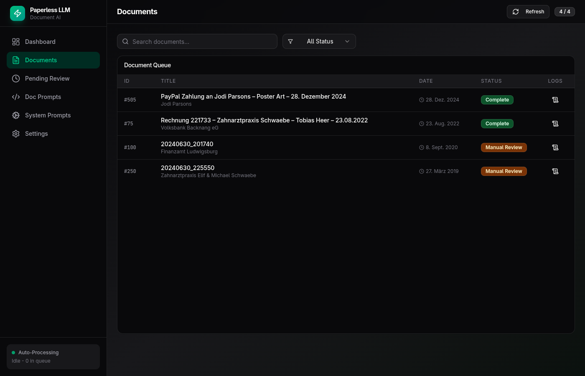
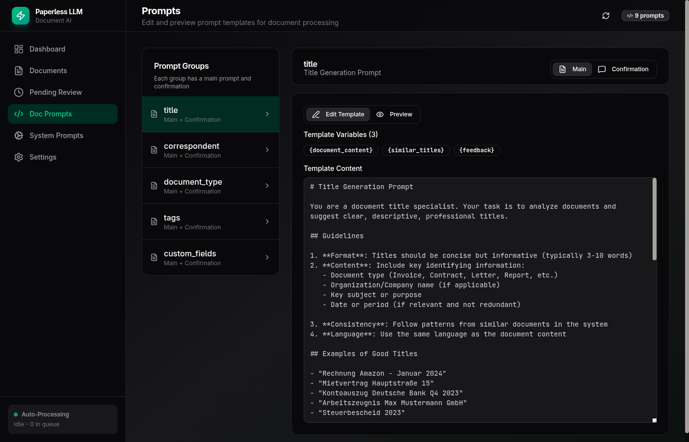
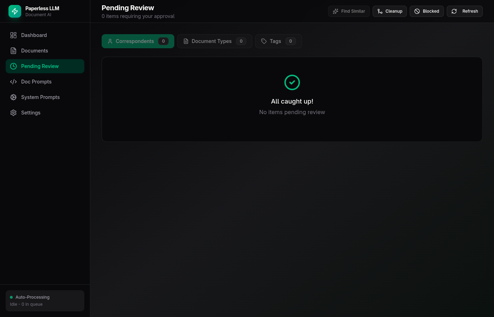

<div align="center">

# Paperless Local LLM

**AI-powered document analysis system for Paperless-ngx**

*Automatic metadata extraction using Mistral AI for OCR and local Ollama models for intelligent title, correspondent, document type, and tag assignment.*

[](LICENSE)
[](https://typescriptlang.org)
[](https://pnpm.io)
[](https://docker.com)

<br />


</div>

---

## Features

- **OCR Processing** — Mistral AI for high-quality text recognition from scanned documents
- **Automatic Metadata** — Title, correspondent, document type, and tag extraction via local LLM models
- **Confirmation Loop** — Large model analysis → Small model verification → Retry or manual review queue
- **Learning Mechanism** — Prevents duplicate suggestions and learns from user feedback
- **Vector Search** — Find similar documents for context using Qdrant
- **Tag-based Workflow** — Independent processing steps with state tracking
- **Live Streaming** — Real-time LLM responses in the frontend
- **Prompt Editor** — Edit and preview prompt templates with variable substitution
- **Multi-language UI** — English and German interface support
- **Docker Ready** — Full Docker Compose setup included

## Screenshots

<div align="center">
<table>
<tr>
<td width="50%">

<p align="center"><strong>Dashboard</strong><br/>Pipeline visualization, queue statistics, and service connections</p>
</td>
<td width="50%">

<p align="center"><strong>Documents</strong><br/>Document queue with status tracking and processing logs</p>
</td>
</tr>
<tr>
<td width="50%">

<p align="center"><strong>Settings</strong><br/>Service configuration and model selection</p>
</td>
<td width="50%">

<p align="center"><strong>Prompts</strong><br/>Edit and preview prompt templates with variables</p>
</td>
</tr>
<tr>
<td width="50%">

<p align="center"><strong>Pending Review</strong><br/>Manual review queue for correspondents, document types, and tags</p>
</td>
<td width="50%">
</td>
</tr>
</table>
</div>

## Quick Start

### Prerequisites

- [Node.js 20+](https://nodejs.org/) — JavaScript runtime
- [pnpm](https://pnpm.io/) — Fast, disk space efficient package manager
- Docker & Docker Compose (optional, for deployment)
- Running instances of:
  - [Paperless-ngx](https://github.com/paperless-ngx/paperless-ngx) — Document management system
  - [Ollama](https://ollama.ai/) — Local LLM inference with your preferred models
  - [Qdrant](https://qdrant.tech/) — Vector database (or use the included Docker Compose)

### Installation

```bash
# Clone the repository
git clone https://github.com/beastyrabbit/paperless-llm.git
cd paperless-llm

# Install all dependencies
pnpm install
```

### Configuration

1. Copy the example configuration:
```bash
cp config.example.yaml config.yaml
```

2. Edit `config.yaml` with your settings:
```yaml
paperless:
  url: "http://your-paperless-server:8000"
  token: "your-paperless-api-token"

mistral:
  api_key: "your-mistral-api-key"

ollama:
  url: "http://your-ollama-server:11434"
  model_large: "your-large-model"    # e.g., llama3.1:70b
  model_small: "your-small-model"    # e.g., llama3.1:8b

qdrant:
  url: "http://your-qdrant-server:6333"
  collection: "paperless-documents"
```

> **Note:** `config.yaml` is gitignored — your secrets stay local.

### Running in Development

**Terminal 1 — Backend:**
```bash
cd apps/backend
pnpm run dev
```

**Terminal 2 — Frontend:**
```bash
pnpm run dev:web
```

The application will be available at `http://localhost:3765`.

## Docker Deployment

```bash
# Set environment variables (or create a .env file)
export PAPERLESS_URL=http://your-paperless:8000
export PAPERLESS_TOKEN=your-token
export MISTRAL_API_KEY=your-key
export OLLAMA_URL=http://host.docker.internal:11434

# Start all services
docker compose up -d

# View logs
docker compose logs -f
```

> **Tip:** Use `host.docker.internal` to access Ollama running on your host machine. This works on Linux, macOS, and Windows thanks to the `extra_hosts` configuration in `docker-compose.yml`.

## Architecture

```
┌─────────────────┐     ┌─────────────────┐     ┌─────────────────┐
│  Next.js        │────▶│  Effect-TS +    │────▶│  Paperless-ngx  │
│  Frontend       │     │  Hono Backend   │     │                 │
└─────────────────┘     └────────┬────────┘     └─────────────────┘
                                 │
                    ┌────────────┼────────────┐
                    ▼            ▼            ▼
              ┌──────────┐ ┌──────────┐ ┌──────────┐
              │  Ollama  │ │ Mistral  │ │  Qdrant  │
              │   LLMs   │ │   OCR    │ │ VectorDB │
              └──────────┘ └──────────┘ └──────────┘
```

## Processing Pipeline

Documents flow through tag-based states for independent, resumable processing:

| Phase | Input Tag | Output Tag | Description |
|-------|-----------|------------|-------------|
| OCR | `llm-pending` | `llm-ocr-done` | Mistral AI OCR extraction |
| Correspondent | `llm-ocr-done` | `llm-correspondent-done` | Assign correspondent |
| Document Type | `llm-correspondent-done` | `llm-document-type-done` | Assign document type |
| Title | `llm-document-type-done` | `llm-title-done` | Generate document title |
| Tags | `llm-title-done` | `llm-tags-done` | Assign relevant tags |
| Complete | `llm-tags-done` | `llm-processed` | Processing finished |

## API Reference

### Settings
| Method | Endpoint | Description |
|--------|----------|-------------|
| GET | `/api/settings` | Get current settings |
| PATCH | `/api/settings` | Update settings |
| POST | `/api/settings/test-connection/{service}` | Test service connection |

### Documents
| Method | Endpoint | Description |
|--------|----------|-------------|
| GET | `/api/documents/queue` | Queue statistics |
| GET | `/api/documents/pending` | Documents pending review |
| GET | `/api/documents/{id}` | Document details |

### Processing
| Method | Endpoint | Description |
|--------|----------|-------------|
| POST | `/api/processing/{id}/start` | Start processing |
| GET | `/api/processing/{id}/stream` | SSE stream of LLM responses |
| POST | `/api/processing/{id}/confirm` | Confirm result |

### Prompts
| Method | Endpoint | Description |
|--------|----------|-------------|
| GET | `/api/prompts` | List all prompts |
| GET | `/api/prompts/{name}` | Get specific prompt |
| PUT | `/api/prompts/{name}` | Update prompt template |

## Project Structure

```
paperless-local-llm/
├── apps/
│   ├── web/                  # Next.js Frontend
│   │   ├── app/              # App router pages
│   │   │   ├── page.tsx      # Dashboard
│   │   │   ├── settings/     # Configuration UI
│   │   │   ├── documents/    # Document browser
│   │   │   ├── pending/      # Review queue
│   │   │   └── prompts/      # Prompt editor
│   │   ├── components/       # React components
│   │   └── lib/              # Utilities & API client
│   │
│   └── backend/              # TypeScript + Effect-TS
│       ├── src/
│       │   ├── index.ts      # Application entry point
│       │   ├── server.ts     # Hono HTTP server
│       │   ├── api/          # Route handlers
│       │   ├── services/     # External service clients
│       │   ├── agents/       # Document processing agents
│       │   ├── config/       # Configuration management
│       │   └── layers/       # Effect dependency injection
│       └── tests/            # Vitest test suites
│
├── packages/
│   └── ui/                   # Shared shadcn/ui components
│
├── config.example.yaml       # Example configuration
├── docker-compose.yml        # Docker setup
└── README.md
```

## Tech Stack

| Layer | Technologies |
|-------|-------------|
| **Frontend** | Next.js 16, React 19, TailwindCSS 4, shadcn/ui |
| **Backend** | TypeScript, Effect-TS, Hono HTTP server |
| **AI/ML** | Ollama (local LLMs), Mistral AI (OCR), Qdrant (vector search) |
| **Infrastructure** | Docker, Turborepo (monorepo), pnpm |

## Development

### Frontend Commands
```bash
pnpm install          # Install dependencies
pnpm run dev:web      # Development server (port 3765)
pnpm run build        # Production build
pnpm run lint         # ESLint
pnpm run typecheck    # TypeScript check
```

### Backend Commands
```bash
cd apps/backend
pnpm run dev          # Development server (port 8765)
pnpm run build        # Production build
pnpm run test         # Run tests with Vitest
pnpm run typecheck    # TypeScript check
```

### Pre-commit Hooks

Git hooks are automatically active (located in `.git/hooks/pre-commit`).

```bash
# Run checks manually
pnpm run precommit
```

Active checks: **gitleaks** (secrets), **TypeScript** (types), **ESLint** (linting), **large files**, **merge conflicts**

## Contributing

Contributions are welcome! Please see [CONTRIBUTING.md](CONTRIBUTING.md) for guidelines.

## License

This project is licensed under the MIT License — see the [LICENSE](LICENSE) file for details.

---

<div align="center">

**[Report Bug](https://github.com/beastyrabbit/paperless-llm/issues)** · **[Request Feature](https://github.com/beastyrabbit/paperless-llm/issues)**

</div>
