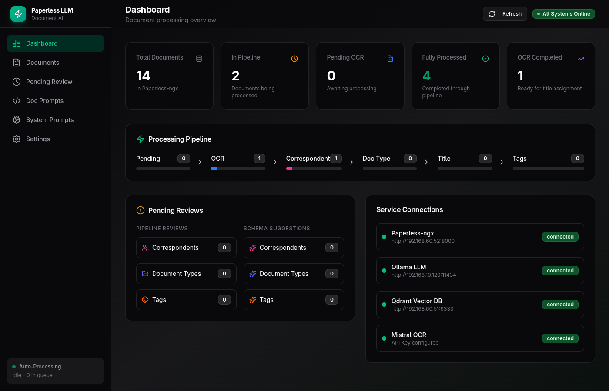
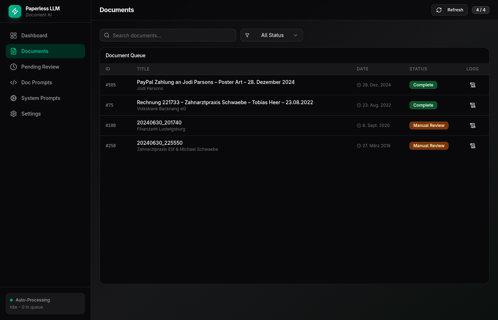
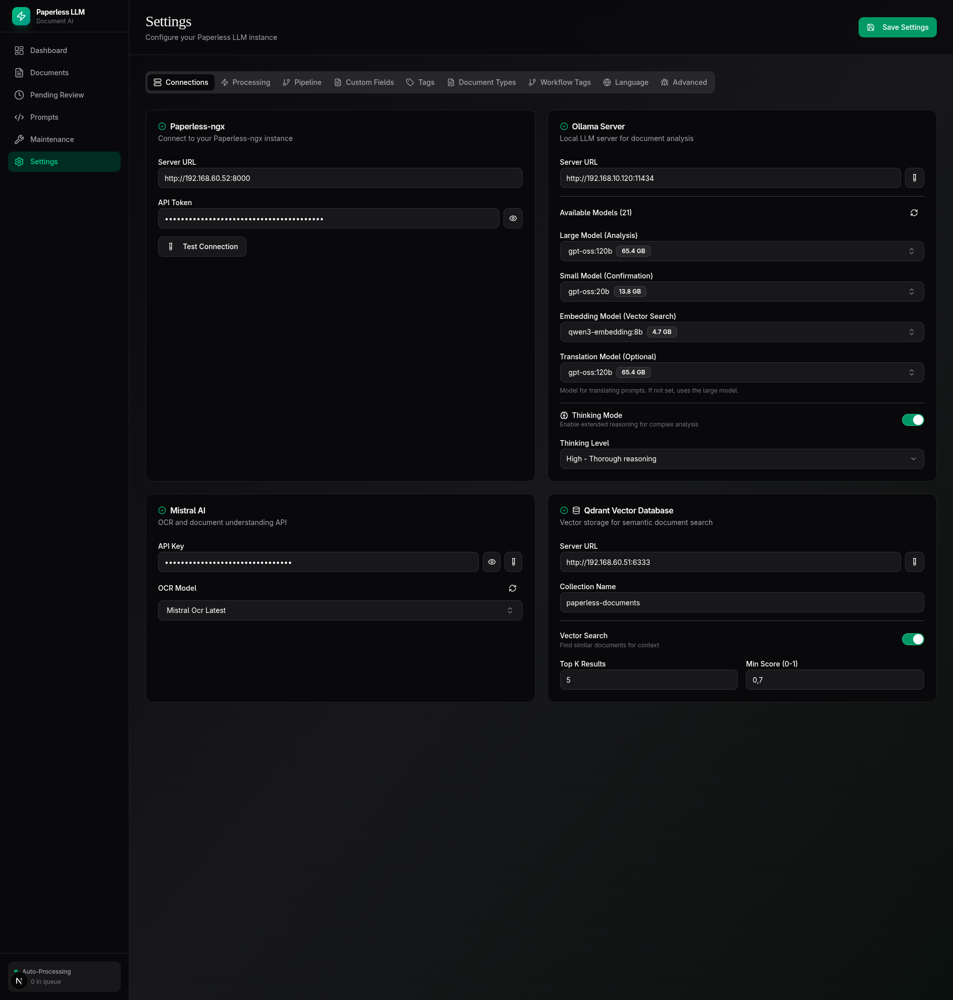
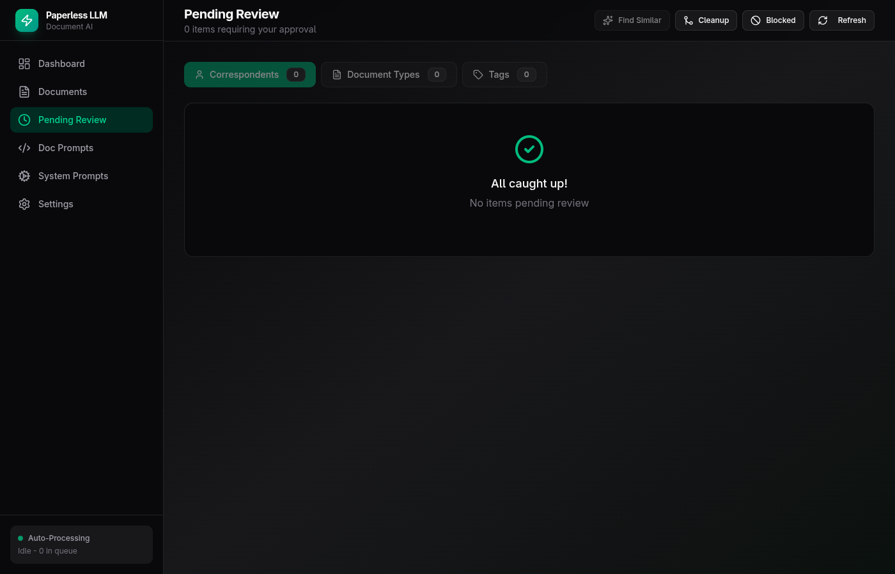

<div align="center">

# Paperless Local LLM

**AI-powered document analysis system for Paperless-ngx**

*Automatic metadata extraction using Mistral AI for OCR and local Ollama models for intelligent title, correspondent, document type, and tag assignment.*

[](LICENSE)
[](https://typescriptlang.org)
[](https://pnpm.io)
[](https://docker.com)

<br />



</div>

---

## Features

- **OCR Processing** — Mistral AI for high-quality text recognition from scanned documents
- **Automatic Metadata** — Title, correspondent, document type, and tag extraction via local LLM models
- **Confirmation Loop** — Large model analysis → Small model verification → Retry or manual review queue
- **Learning Mechanism** — Prevents duplicate suggestions and learns from user feedback
- **Vector Search** — Find similar documents for context using Qdrant
- **Tag-based Workflow** — Independent processing steps with state tracking
- **Live Streaming** — Real-time LLM responses in the frontend
- **Document Cases** — Durable case state, human questions, and resumable Pi agent runs
- **Multi-language UI** — English and German interface support
- **Docker Ready** — Full Docker Compose setup included

## Screenshots

<div align="center">
<table>
<tr>
<td width="50%">

<p align="center"><strong>Dashboard</strong><br/>Pipeline visualization, queue statistics, and service connections</p>
</td>
<td width="50%">

<p align="center"><strong>Documents</strong><br/>Document queue with status tracking and processing logs</p>
</td>
</tr>
<tr>
<td width="50%">

<p align="center"><strong>Settings</strong><br/>Service configuration and model selection</p>
</td>
<td width="50%">

<p align="center"><strong>Document Cases</strong><br/>Structured metadata decisions with resumable case state</p>
</td>
</tr>
<tr>
<td width="50%">

<p align="center"><strong>Pending Review</strong><br/>Manual review queue for correspondents, document types, and tags</p>
</td>
<td width="50%">
</td>
</tr>
</table>
</div>

## Quick Start

### Prerequisites

- [Node.js 20+](https://nodejs.org/) — JavaScript runtime
- [pnpm](https://pnpm.io/) — Fast, disk space efficient package manager
- Docker & Docker Compose (optional, for deployment)
- Running instances of:
  - [Paperless-ngx](https://github.com/paperless-ngx/paperless-ngx) — Document management system
  - [Ollama](https://ollama.ai/) — Local LLM inference with your preferred models
  - [Qdrant](https://qdrant.tech/) — Vector database (or use the included Docker Compose)

### Installation

```bash
# Clone the repository
git clone https://github.com/beastyrabbit/paperless-llm.git
cd paperless-llm

# Install all dependencies
pnpm install
```

### Configuration

1. Copy the example configuration:
```bash
cp config.example.yaml config.yaml
```

2. Edit `config.yaml` with your settings:
```yaml
paperless:
  url: "http://your-paperless-server:8000"

mistral:
  model: "mistral-ocr-latest"

ollama:
  url: "http://your-ollama-server:11434"
  model: "your-generation-model"     # e.g., llama3.2
  model_large: "your-analysis-model"
  model_small: "your-verifier-model"
  embedding_model: "nomic-embed-text"

qdrant:
  url: "http://your-qdrant-server:6333"
  collection: "paperless-documents"
```

> **Note:** `PAPERLESS_TOKEN` and `MISTRAL_API_KEY` are environment-only
> credentials. Inject them with Infisical; YAML values are ignored, and the
> settings GUI does not store or update them.
> In production, set `PAPERLESS_LLM_CONFIG=/absolute/path/to/config.yaml` when
> loading YAML config. The backend will not walk parent directories for
> `config.yaml` in production.

### Running in Development

**Full stack via Portless:**
```bash
pnpm run dev
```

The application will be available at `https://paperless-llm-web.localhost:1355`.
The backend route will be available at `https://paperless-llm-api.localhost:1355`.
Portless uses the shared proxy port `1355`; service names keep this project separate from other local projects while app ports are assigned automatically.
If Portless is unavailable, use the direct localhost scripts below.

**Fallback direct ports:**
```bash
pnpm run dev:web       # Frontend on http://localhost:3765
pnpm run dev:backend   # Backend on http://localhost:8765
```

## Docker Deployment

```bash
# Validate the Infisical prod environment and resolved Compose configuration
pnpm run compose:config:prod

# Build and start all services with the same runtime variable contract as dev
pnpm run deploy:prod

# Run further Compose commands with the Infisical prod environment
pnpm run compose:prod -- logs -f
```

`PAPERLESS_URL`, `PAPERLESS_TOKEN`, `MISTRAL_API_KEY`, `OLLAMA_URL`,
`QDRANT_URL`, `PAPERLESS_LLM_API_TOKEN`, and `APP_VERSION` are required in
Infisical for both `dev` and `prod`. Local and deployed starts use the same
validated variable names; environment-specific values may differ deliberately.
Compose has no localhost provider fallback.

## Architecture

```
┌─────────────────┐     ┌─────────────────┐     ┌─────────────────┐
│  Next.js        │────▶│  Effect-TS +    │────▶│  Paperless-ngx  │
│  Frontend       │     │  Effect Backend │     │                 │
└─────────────────┘     └────────┬────────┘     └─────────────────┘
                                 │
                    ┌────────────┼────────────┐
                    ▼            ▼            ▼
              ┌──────────┐ ┌──────────┐ ┌──────────┐
              │  Ollama  │ │ Mistral  │ │  Qdrant  │
              │   LLMs   │ │   OCR    │ │ VectorDB │
              └──────────┘ └──────────┘ └──────────┘
```

## Processing Pipeline

Documents flow through tag-based states for independent, resumable processing:

| Phase | Input Tag | Output Tag | Description |
|-------|-----------|------------|-------------|
| OCR | `llm-pending` | `llm-ocr-done` | Mistral AI OCR extraction |
| Correspondent | `llm-ocr-done` | `llm-correspondent-done` | Assign correspondent |
| Document Type | `llm-correspondent-done` | `llm-document-type-done` | Assign document type |
| Title | `llm-document-type-done` | `llm-title-done` | Generate document title |
| Tags | `llm-title-done` | `llm-tags-done` | Assign relevant tags |
| Complete | `llm-tags-done` | `llm-processed` | Processing finished |

## API Reference

### Settings
| Method | Endpoint | Description |
|--------|----------|-------------|
| GET | `/api/settings` | Get current settings |
| PATCH | `/api/settings` | Update settings |
| POST | `/api/settings/test-connection/{service}` | Test service connection |

### Documents
| Method | Endpoint | Description |
|--------|----------|-------------|
| GET | `/api/documents/queue` | Queue statistics |
| GET | `/api/documents/pending` | Documents by workflow status |
| GET | `/api/documents/{id}` | Document details |

### Cases
| Method | Endpoint | Description |
|--------|----------|-------------|
| GET | `/api/cases` | List document cases |
| GET | `/api/cases/document/{id}` | Get or create a document case |
| POST | `/api/cases/document/{id}/run` | Run or resume a document case |

### Processing
| Method | Endpoint | Description |
|--------|----------|-------------|
| POST | `/api/processing/{id}/start` | Start processing |
| GET | `/api/processing/{id}/stream` | SSE stream of LLM responses |
| POST | `/api/processing/{id}/confirm` | Confirm result |

## Project Structure

```
paperless-local-llm/
├── apps/
│   ├── web/                  # Next.js Frontend
│   │   ├── app/              # App router pages
│   │   │   ├── page.tsx      # Dashboard
│   │   │   ├── settings/     # Configuration UI
│   │   │   ├── documents/    # Document browser
│   │   │   ├── pending/      # Review queue
│   │   │   ├── cases/        # Document case queue
│   │   │   └── catalog/      # Catalog agent proposals
│   │   ├── components/       # React components
│   │   └── lib/              # Utilities & API client
│   │
│   └── backend/              # TypeScript + Effect-TS
│       ├── src/
│       │   ├── index.ts      # Application entry point
│       │   ├── server.ts     # Node HTTP server with Effect runtime
│       │   ├── api/          # Route handlers
│       │   ├── services/     # External service clients
│       │   ├── agents/       # Document processing agents
│       │   ├── config/       # Configuration management
│       │   └── layers/       # Effect dependency injection
│       └── tests/            # Vitest test suites
│
├── packages/
│   └── ui/                   # Shared shadcn/ui components
│
├── config.example.yaml       # Example configuration
├── docker-compose.yml        # Docker setup
└── README.md
```

## Tech Stack

| Layer | Technologies |
|-------|-------------|
| **Frontend** | Next.js 16, React 19, TailwindCSS 4, shadcn/ui |
| **Backend** | TypeScript, Effect-TS, Node HTTP server |
| **AI/ML** | Ollama (local LLMs), Mistral AI (OCR), Qdrant (vector search) |
| **Infrastructure** | Docker, Turborepo (monorepo), pnpm |

## Development

### Frontend Commands
```bash
pnpm install          # Install dependencies
pnpm run dev          # Frontend + backend via Portless
pnpm run dev:web      # Frontend only (port 3765)
pnpm run build        # Production build
pnpm run lint         # Biome lint
pnpm run typecheck    # TypeScript check
```

### Backend Commands
```bash
pnpm run dev:backend  # Backend only (port 8765)
pnpm run build        # Production build
pnpm run test         # Run tests with Vitest
pnpm run typecheck    # TypeScript check
```

### Pre-commit Hooks

Git hooks are automatically active (located in `.git/hooks/pre-commit`).

```bash
# Run checks manually
pnpm run precommit
```

Active checks: **gitleaks** (secrets), **TypeScript** (types), **Biome** (linting), **large files**, **merge conflicts**

`gitleaks` is expected to be available on contributor machines because lefthook calls
`gitleaks protect --staged --no-banner`. Install it through your package manager or
`brew install gitleaks`; CI should keep it as a second gate for protected branches.

The Docker publish workflow uses the self-hosted ARC runner label
`arc-paperless-local-llm`. Maintainers need that runner online for release images; forks can run
the same build commands locally with Docker if the runner label is unavailable.

### Environment Variables

| Variable | Description |
|----------|-------------|
| `PAPERLESS_URL` | Paperless-ngx base URL |
| `PAPERLESS_TOKEN` | Paperless API token |
| `MISTRAL_API_KEY` | Mistral OCR API key |
| `OLLAMA_URL` | Ollama server URL |
| `QDRANT_URL` | Qdrant server URL |
| `PAPERLESS_LLM_API_TOKEN` | Optional backend API token |
| `PAPERLESS_LLM_TRUSTED_UI_ORIGINS` | Optional comma-separated CORS allowlist |

### Pi Prompt Policy

Pi agent instructions, tools, schemas, and structured placeholders live in TypeScript. Do not
reintroduce file-backed prompts or `PromptService`; Docker images no longer copy
`apps/backend/prompts`.

## Contributing

Contributions are welcome! Please see [CONTRIBUTING.md](CONTRIBUTING.md) for guidelines.

## License

This project is licensed under the MIT License — see the [LICENSE](LICENSE) file for details.

---

<div align="center">

**[Report Bug](https://github.com/beastyrabbit/paperless-llm/issues)** · **[Request Feature](https://github.com/beastyrabbit/paperless-llm/issues)**

</div>
